## Hi there 👋  
I am a dedicated software engineer and modpack developer with a passion for crafting creative solutions. My expertise lies in **JavaScript** and **Java**, with a focus on delivering high-quality projects.

  <h2>📊 Statistics</h2>
  
     

  

---

## My Two Main Projects  

### Create - Forge Frontier  
 
#### A comprehensive modpack designed for Minecraft enthusiasts who love automating with the Create mod. Forge Frontier brings unique challenges and adventures to elevate your gameplay.

### Landscapes Reimagined - Genesis  

#### Explore stunning, immersive environments in this modpack that redefines the landscapes of Minecraft while adding deep, engaging gameplay elements.  

---  

<!-- Optional Ideas Section -->
<!--  
**M0nkeyPr0grammer/M0nkeyPr0grammer** is a ✨ _special_ ✨ repository because its `README.md` (this file) appears on your GitHub profile.

Here are some ideas to get you started:  
- 🔭 I’m currently working on ...  
- 🌱 I’m currently learning ...  
- 👯 I’m looking to collaborate on ...  
- 🤔 I’m looking for help with ...  
- 💬 Ask me about ...  
- 📫 How to reach me: ...  
- 😄 Pronouns: ...  
- ⚡ Fun fact: ...  
-->
